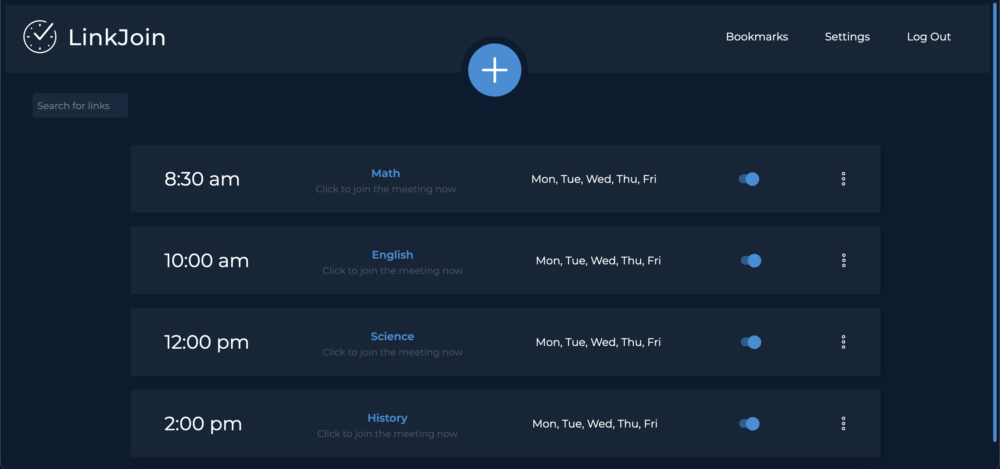

# LinkJoin
<a href="https://linkjoin.xyz">LinkJoin</a> is a website that organizes and automatically opens virtual meetings.

With virtual meetings in the comfort of your own home, it becomes difficult to remember to click a link to join a meeting.
LinkJoin organizes meeting links all in one place, and automatically opens them at the right time.
LinkJoin also has a space to take notes on individual meetings, so it's easier to keep track of materials from meeting to meeting.
Pre-scheduled meetings can be shared from person to person via a share link. 
A user clicks the link, and the meeting is added to their LinkJoin.

